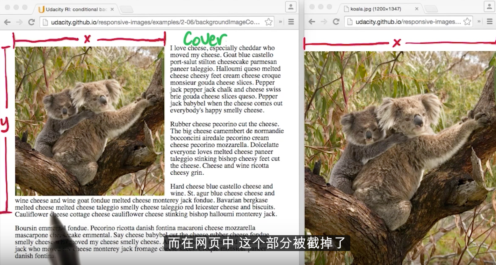

### CSS 背景图片技巧

`background-size: cover`

`cover` 属性下，图片会尽可能的小，也就是图片的最小边长和包含块的最小边长相等。所以图片的最大边就会溢出包含块。

`background-size: contain`

`contain` 属性下图片会被完全显示出来，为达到这样的效果就意味着某一个边长可能会小于包含块的边长。

### 符号字符

避免使用图片并保持网站的响应性。

### 图标字体

[课程链接](https://classroom.udacity.com/courses/ud882/lessons/3483659506/concepts/34791494350923)

### SVG 和数据 URL 内嵌图片

[课程链接](https://classroom.udacity.com/courses/ud882/lessons/3483659506/concepts/35887786310923#)

